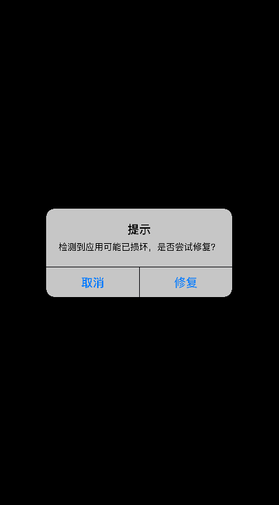

# GYBootingProtection
A tool for detecting and repairting continuous launch crash of iOS App

## 说明
### 引入项目

1. 将 `src` 目录下所有文件拖拽到你的 Xcode 项目（如果你已经在项目中使用了 Ryan Maxwell 的 `UIAlertView+Blocks`，则可以删除 `src` 目录下对应的`UIAlertView+Blocks.m` `UIAlertView+Blocks.h` 文件）

2. 在 `AppDelegate+GYBootingProtection.m` 的 `onBeforeBootingProtection` 方法中添加检测前需要执行的代码，比如设置crash上报：

  ```
  - (void)onBeforeBootingProtection {
      // setup logger
      // setup crash report 
  }
  ```

### 测试与使用

1. 首先制造连续闪退场景：

  启动后 5 秒内，双击 Home 通过上划手势 kill 掉 App，重复多次。（也可以在代码里人为制造crash）

2. 当连续闪退超过 5 次时，会提示用户修复：

  

3. 用户轻触修复，App 重置初始状态，连续闪退问题解决：

  

